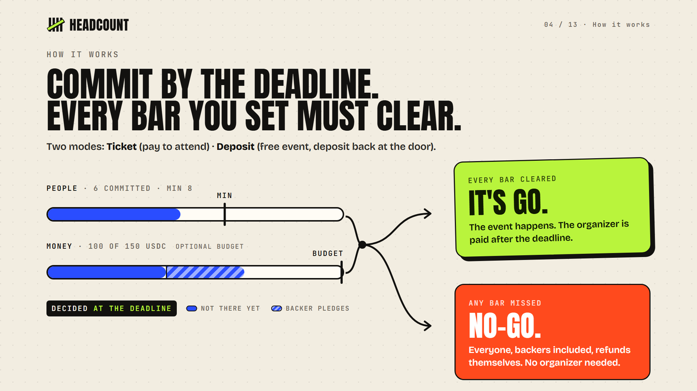

<p align="center">
  <picture>
    <source media="(prefers-color-scheme: dark)" srcset="brand/headcount-logo-dark.svg">
    
  </picture>
</p>

<h3 align="center">The event happens when the headcount does.</h3>

<p align="center">
  <a href="https://headcount.sorevo.de"></a>
  <a href="https://headcount.sorevo.de/pitch/"></a>
  <a href="https://headcount.sorevo.de/pitch/video.html"></a>
  <a href="#sponsored-fees"></a>
</p>

<p align="center">
  <a href="https://headcount.sorevo.de/pitch/"></a>
</p>

People put money down by a deadline. Enough people: it's **GO**. Not enough: everyone gets their money back, by rules enforced on Solana. Anyone can trigger a refund, and the app refunds everyone an hour after a NO-GO.

Every organizer knows the problem: 40 people click "interested", 9 show up. The venue is booked, the pizza is ordered, and the organizer pays for the gap. Kickstarter solved this for products (all-or-nothing funding), but not for the Tuesday meetup, the team offsite or the bus to the conference.

Headcount is all-or-nothing for events, on Solana:

- **Ticket event:** people commit the ticket price in USDC before a deadline. If the minimum headcount is reached (and the budget, if the organizer set one), the event is **GO** and the organizer is paid after the deadline. If not, it is **NO-GO** and everyone gets their money back without the organizer: press refund, or the app does it for everyone an hour later.
- **Backers:** a company, a student chapter or a friend can back a ticket event with money, without taking a seat. Pledges count toward the budget, never toward the headcount. _Backers can pay for the pizza, but they can't fake the headcount._
- **Deposit event:** people commit a small deposit. Show up, scan the door screen, get your deposit back. Don't show up, and your deposit pays for the pizza.

The money never sits with the organizer or with us. It sits in a vault owned by the program, and the rules below are the only ways out.

> Status: hackathon project for Superteam Germany's "Build an MVP with Solana at WHU".
>
> **Live demo on Solana devnet: https://headcount.sorevo.de** · **Pitch deck: https://headcount.sorevo.de/pitch/** ([PDF](https://headcount.sorevo.de/pitch/headcount-pitch.pdf)) · **[90-second demo video](https://headcount.sorevo.de/pitch/video.html)** (real transactions on a local validator, same program). Program `9NeaXRkbU4Jxsmh2aJyN74gxRoAR7fYupV68FEzDH6KH` ([explorer](https://explorer.solana.com/address/9NeaXRkbU4Jxsmh2aJyN74gxRoAR7fYupV68FEzDH6KH?cluster=devnet)).
>
> **Fastest way to judge it:** switch your wallet to devnet (Phantom: Settings → Developer Settings → Testnet Mode), open [Hackathon Pizza Night](https://headcount.sorevo.de/e/41w36CuNi1fga9Tb8btkaVvv8KBB6Q9p2Ukau3b3ecGb), tap *Get test USDC*, then commit 10 USDC. The app pays the network fees, so no SOL is needed. Creating your own event is not sponsored: the organizer needs a little devnet SOL ([faucet.solana.com](https://faucet.solana.com)).

## A walkthrough

1. The organizer creates "Hackathon Pizza Night": ticket 10 USDC, minimum 8 people, budget 150 USDC.
2. The event page shows a QR code. People scan it with a Solana wallet (Solana Pay) and commit. Two bars fill live: people and money. A sponsor backs it with 40 USDC from the same page ("Back this event, no seat"). With 8 or more people and 150 USDC (tickets plus pledges) the event is **GO** at the deadline.
3. A deposit event ("Anchor Study Group"): at the entrance a laptop shows the **door screen**, a QR that renews every 30 seconds. Each attendee scans it with their wallet and checks themselves in; the deposit comes straight back.
4. After the event, the organizer sweeps the no-show deposits: the pizza is paid.
5. An event misses its goal: **NO-GO**. Every participant and backer presses "refund" and has their money back in a second, even if the organizer has vanished.

No SOL needed on the phone: with `SPONSOR_SECRET_KEY` set, the app pays network fees and account rent.

## Rules the program enforces

| Situation                                                       | What happens                                                                      |
| --------------------------------------------------------------- | --------------------------------------------------------------------------------- |
| Headcount (and budget, if set) reached by the deadline (ticket) | organizer withdraws tickets and pledges, but only after the deadline; 2 % goes to the Headcount treasury |
| Goal missed                                                     | every participant and backer is refunded; anyone may trigger it, the tokens only go to the owner's own token account |
| Money covered by backers, but too few people                    | NO-GO: pledges close the money gap, never the people gap                          |
| Organizer cancels (only before the deadline)                    | everyone refunds immediately; after the deadline the outcome is final             |
| Check-in (deposit, from the deadline until the event end)       | deposit goes back to the participant in the same transaction                      |
| No-show (deposit)                                               | organizer sweeps the remaining deposits after the event; 5 % goes to the treasury |
| Refunds and deposits returned at check-in                      | always free of fees                                                                |
| NO-GO or cancelled, and everyone refunded                      | the organizer may close the event and its vault (`close_event`) and gets the rent back |
| Deposit event where nobody was checked in                       | counts as not held: everyone refunds, the organizer cannot sweep                  |
| Account rent (commitments, pledges)                             | goes back to whoever paid it (the participant or the app) when the account closes |
| Token-2022 mints (fees, hooks, delegates)                       | rejected: only classic SPL tokens such as USDC                                    |
| Deadlines                                                       | at most 180 days out, event end at most 60 days after the deadline                |

## Budget goal and backers

On `/new`, a ticket event can get an optional **budget goal** (e.g. 500 USDC for the venue). The event is GO only when both are true by the deadline: participants ≥ minimum **and** tickets + pledges ≥ budget.

Anyone can **back** a ticket event on its page: choose an amount, scan the QR or use the browser wallet. A backer gets no seat and never counts toward the headcount. If the event is NO-GO or cancelled, backers take their pledge back exactly like participants (`refund_pledge`; the event page's refund button returns ticket and pledge together).

## Door pass (self check-in)

Deposit events are checked in by the attendees themselves: the chain verifies a signed pass from the door screen, so check-in does not depend on the organizer ticking a name.

1. The organizer opens `/e/<event>/door` on the laptop or tablet at the entrance. The page creates a **door key** in that browser and shows a QR the organizer scans once to register it (`set_door_key`).
2. The door screen then shows a pass: the door key signs `headcount-pass:v1 || event || expires_at` with `expires_at = now + 90 s`, and the QR is a Solana Pay link `/api/tx/pass/<event>?exp=…&sig=…`. It renews every 30 seconds.
3. The attendee scans it with the wallet they committed from. The app builds `[Ed25519 signature check, check_in_with_pass]`, simulates it and hands it to the wallet. The program verifies that the check right before it covers exactly this event and expiry, signed by the registered door key, valid for at most 120 s.
4. Clear errors instead of wallet failures: expired pass, wrong screen, no door screen yet, check-in not open, already checked in.

The organizer's manual check-in (organizer page, or scanning the attendee's ticket QR) stays as a fallback for people without a phone.

## Sponsored fees

Set `SPONSOR_SECRET_KEY` (base58 secret key, or a JSON byte array) to let the app pay for its users:

- commits and pledges: the app is fee payer **and** pays the account rent; the server partially signs before returning the Solana Pay transaction, the wallet adds its own signature;
- door check-ins and refunds: the app pays the network fee; an hour after a NO-GO (or a cancel) the app refunds everyone still waiting, in batches, so nobody has to come back for their money;
- when a commitment or pledge is closed, its rent goes back to whoever paid it (`rent_payer` stored on the account): on refund, or, once an event is settled, by `close_commitment` / `close_pledge`, which anyone may call. The app runs them every 30 minutes for the rent it sponsored.
- limits: sponsored transactions per wallet per hour and per day; the devnet test-token faucet gives 20 tokens once a day per wallet and per IP, at most 40 a day, and never spends the sponsor's SOL.

Event pages then say "No SOL needed". Without the variable, every wallet pays its own fees and rent.

## Why Solana

- **Money that waits in neutral custody.** An escrow that a program owns and nobody can empty outside the rules. That is what makes "everyone can take it back without asking anyone" believable to people who don't know the organizer.
- **Small amounts make sense.** A 5 USDC deposit costs a fraction of a cent to commit, refund or return at the door, and confirms in about a second, fast enough for a queue at the door.
- **Solana Pay works with the wallets people already have.** Scan a QR, approve, done. No app to install, no account to create, and with sponsored fees not even SOL.
- **Native signature checks.** The door pass is verified on-chain with the Ed25519 program, so the check-in rule is enforced by the chain, not by our server.

## How it works

```
 Phone wallet ──Solana Pay──▶ Headcount app (Express) ──builds + simulates tx──▶ headcount program (Anchor)
                               │ event pages, QR codes, live status                   │ event PDA + vault (USDC)
                               │ door screen (renewing pass QR)                        │ commitment PDA per participant
                               └ organizer page: withdraw, sweep, cancel, check-in     └ pledge PDA per backer
```

| What                                                                                                 | Where                                  |
| ---------------------------------------------------------------------------------------------------- | -------------------------------------- |
| Program: create, commit, pledge, withdraw, cancel, refund, refund_pledge, check-in, door pass, sweep, close_event, fees | `anchor/programs/headcount/src/lib.rs` |
| Program tests (75 checks against a local validator)                                                  | `tests/program.test.ts`                |
| Solana Pay transaction requests, JSON API                                                            | `app/app.ts`                           |
| Reading events, building and simulating transactions                                                 | `app/chain.ts`                         |
| Pages (event, backing, ticket, door screen, organizer, new event)                                    | `app/views.ts`                         |
| End-to-end test of the app (real transactions)                                                       | `scripts/app-smoke.ts`                 |
| Demo data (every state, a budget with a backer, a door screen)                                       | `scripts/demo-seed.ts`                 |

Every Solana Pay endpoint simulates the transaction before handing it to the wallet. If it would fail, you get a sentence ("Payout is available after the commit deadline.") instead of a wallet error.

## Verify on devnet

Real transactions of the deployed program (Solana Explorer, devnet):

| Action | Transaction |
| --- | --- |
| Create an event | [dScubypL…](https://explorer.solana.com/tx/dScubypL2GQ6g955uNu9fSuPAqa3HGr9gfN6nKTSucgSXh9Uccvq6Xu7LN6dCFQUd32stWrTXL2JzbtEt7jPK7N?cluster=devnet) |
| Commit (fees and rent paid by the app) | [5euDa7FD…](https://explorer.solana.com/tx/5euDa7FDh1mdU3xTC1z5BQUSGq7tpQknX2hxCfKvMU4HSvEaYc2sxL4oRqcMBmcUGZp7sXfZBozTjJzDqnZMn7HF?cluster=devnet) |
| Back an event (pledge, no seat) | [4r8jWFT6…](https://explorer.solana.com/tx/4r8jWFT6Mewin1nHqgzHnFKv6wXvkYgAcmKkoGKAoKSubpJBd8fZtv1zrjjKAQq9EgJt8ey5XeP4qyfc1FCbsBnc?cluster=devnet) |
| Door-pass check-in: Ed25519 signature check, then `check_in_with_pass` in one transaction | [2w7L5oVV…](https://explorer.solana.com/tx/2w7L5oVVwoo4BmgEzao9Ke19844LXjWxiFJGqW3FLsWGWitz6jFRnr6Df2Fv54xdXy7qxsxBXTkMudpbRSN3BUYb?cluster=devnet) |
| Manual check-in by the organizer (fallback) | [4pX1N9Bs…](https://explorer.solana.com/tx/4pX1N9BsBgPnFGQuxGZP9x3WdZEY5JZvZA1KtrTbz2G4cSenMmVtQ69mv4CLhCZJZb37NmrzN46MFeRWAKSbm17F?cluster=devnet) |
| GO payout: 2 % to the treasury, the rest to the organizer | [4usqeRuj…](https://explorer.solana.com/tx/4usqeRujzqEGPig47Uh2JUr5FJQJcMhx5g8iajJRxPB3rZXV2MZFYC3AYeMMEgPps5UpeoYuYsXu58y2HEnpN9BB?cluster=devnet) |
| NO-GO refund triggered by someone else; the tokens go to the participant | [5FRnXJ5d…](https://explorer.solana.com/tx/5FRnXJ5dwRmw9k94sSSQQrkDfPJQnCRNcxUmWGSdARvCygqY4nYxzFmDTxRBKDg4zXUD7fRXuY1v8WTq1bURc4B4?cluster=devnet) |
| Everyone refunded: the organizer closes the event and its vault | [5xMcJp1W…](https://explorer.solana.com/tx/5xMcJp1W2w1uC3RDno8u6TrFpuqfJAMSLuCDUexycydNj3mfQQk6BazuXcjT5NVij8T5H6nwjuTgVgJPszKa7raq?cluster=devnet) |

Every instruction, including refunds, payouts and closing settled accounts, is exercised by the 75 program checks and the 124 end-to-end app checks below.

## Try it

[](https://github.com/NWichter/headcount/actions/workflows/tests.yml) Both suites run on every push (`.github/workflows/tests.yml`): the program is built, loaded into a local validator, then `npm test` and `npm run app:smoke`.

Requirements: Node ≥ 20.18, Docker (for the Anchor build) and a Solana validator.

```bash
npm install
# build the program (Anchor 0.32.1 in Docker)
docker run --rm -v "$PWD/anchor:/workdir" -w /workdir solanafoundation/anchor:v0.32.1 anchor build
# another terminal: load the program at its fixed id; the feature flag matches devnet
# (Agave 4.x would reject this sBPF version otherwise)
solana-test-validator --reset --limit-ledger-size 50000000 \
  --deactivate-feature B8JJXCy5amZyWG9r7EnUYLwzXSXTxG7GZ1qZ1qggo83g \
  --bpf-program 9NeaXRkbU4Jxsmh2aJyN74gxRoAR7fYupV68FEzDH6KH anchor/target/deploy/headcount.so
npm test                         # 75 program checks
npm run app:smoke                # 124 app checks end to end, with its own test mint and wallets
npx tsx scripts/demo-seed.ts     # demo events; prints MINT and the door-screen link
MINT=<classic SPL mint> npm run app   # http://localhost:4040
```

Environment (`.env`): `SOLANA_RPC_URL`, `SOLANA_CLUSTER` (`localnet` | `devnet`), `MINT`, `MINT_SYMBOL`, `PUBLIC_URL`, `PORT`, optional `SPONSOR_SECRET_KEY` (the app pays fees and rent) and, on test networks, `TEST_MINT_AUTHORITY` (mint authority of `MINT`: enables the 20-token test faucet, once per wallet per day). For phones, the app must be reachable over https: set `PUBLIC_URL`. The same program and app run on devnet (`SOLANA_CLUSTER=devnet`, a 6-decimal test mint as `MINT` whose authority is `TEST_MINT_AUTHORITY`). `scripts/deploy-local.sh` and `scripts/deploy-devnet.sh` deploy with the program keypair, which is not in the repo.

## Limits (honest)

- A door pass can be forwarded within its ~90 s window: someone at the door could send a photo of the QR to a friend outside. Short expiry keeps this small; it does not make it impossible.
- The organizer decides which door screen is valid: whoever holds the organizer key registers (and can rotate) the door key, and can still check people in by hand.
- Pledges and commitments are one per wallet and event.
- One token per deployment of the app (`MINT`), typically USDC.
- Sponsored fees are paid by the app's wallet; on mainnet it needs its own SOL budget.
- The fee rates and the treasury are constants in the program. On devnet they apply to every payout since the upgrade, including events created before it.
- Only NO-GO or cancelled events can be closed; closing GO events needs open-account counters (a new account layout).
- The organizer can reach the minimum with wallets of their own (the money comes back at payout) and check those in by hand. Reputation and organizer stakes are the answer we plan.
- No reputation yet: a participant who never shows up can commit again next time.

## License

Proprietary. Copyright (c) 2026 Niklas Wichter. All rights reserved. The code is public for review only; see LICENSE.
